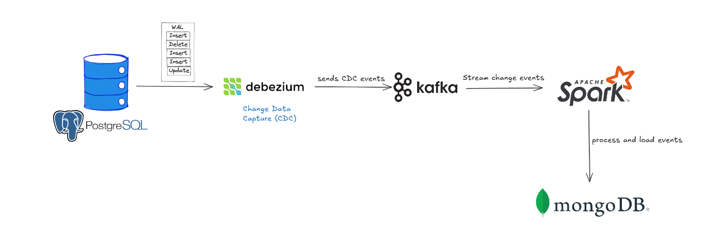

# CDC-CQRS pipeline with Debezium and Kafka

## What is CDC-CQRS pipeline ?

A **CDC-CQRS pipeline** combines two powerful architectural patterns:

- **CDC (Change Data Capture) :** Captures real-time changes (INSERT, UPDATE, DELETE) from a database (e.g., PostgreSQL WAL logs via Debezium).
- **CQRS (Command Query Responsibility Segregation):** Separates read and write models — one database handles **writes** (PostgreSQL), while another is optimized for **reads** (e.g., MongoDB).

You can read some articles to get more detail:

1. https://debezium.io/blog/2023/02/04/ddd-aggregates-via-cdc-cqrs-pipeline-using-kafka-and-debezium
2. https://www.upsolver.com/blog/cqrs-event-sourcing-build-database-architecture


## **CDC-CQRS pipeline with Debezium and Kafka**



### 📌 Short Description of the Project (Based on the Diagram)

This is a **real-time data synchronization and analytics pipeline** using CDC and CQRS:

1. **PostgreSQL** – Primary transactional data store (write model).
2. **Debezium** – Captures real-time change events (CDC) from PostgreSQL WAL logs.
3. **Kafka** – Acts as the event backbone, streaming CDC messages.
4. **Apache Spark** – Consumes Kafka streams, performing real-time processing CDC events and loads/updates data in MongoDB.
5. **MongoDB** – Serves as the optimized read model for fast queries and analytics.

---

### 🧩 Purpose of the Pipeline

- Enable real-time data replication from PostgreSQL to MongoDB.
- Support separation of concerns:
    - PostgreSQL: optimized for transactional writes.
    - MongoDB: optimized for analytical or reporting reads.
- Allow for data transformation mid-stream (via Spark Streaming), e.g., formatting, enrichment, aggregation.

---

## **Project Structure**

```
cdc-cqrs-pipeline/
├── script/                        # Contains scripts for initial setup and batch data loading
│   ├── first_load.py              # Loads data from PostgreSQL to MongoDB using Spark
│   ├── setup-pg-db.py             # Sets up PostgreSQL database and user for CDC
│   ├── insert_sample_data.py      # Inserts sample data into PostgreSQL
│   └── initial/
│       └── ecommerce.sql          # SQL schema and initial data for the e-commerce database
├── streaming/                     # Contains Spark streaming jobs for CDC event processing
│   ├── kafka-to-mongo-products.py         # Streams product changes from Kafka to MongoDB
│   ├── kafka-to-mongo-orders.py           # Streams order changes from Kafka to MongoDB
│   └── kafka-to-mongo-order_details.py    # Streams order detail changes from Kafka to MongoDB
├── requirements.txt               # Python dependencies for the project
├── pg-ecommerce-connector.json.example    # Example Debezium connector config for PostgreSQL CDC
└── README.md                      # Project documentation and usage instructions
```

---

## **Setup Instructions**

1. Install Dependencies

```
pip install -r requirements.txt
```

2. Setup PostgreSQL Database

```
python script/setup-pg-db.py
```

3. Insert Sample Data

Execute the program for testing insertion to source database.

```
python script/insert_sample_data.py
```

4. Start Kafka and Debezium

- Configure Debezium using`pg-ecommerce-connector.json.example`.
- Start Kafka and Debezium services.

5. Initial Load to MongoDB

```
spark-submit \
--packages org.mongodb.spark:mongo-spark-connector_2.12:10.5.0,org.postgresql:postgresql:42.7.7 \
script/first_load.py
```

6. Start Streaming CDC Events

```
spark-submit streaming/kafka-to-mongo-products.py
spark-submit streaming/kafka-to-mongo-orders.py
spark-submit streaming/kafka-to-mongo-order_details.py
```

## **Notes**

- Update connection strings and credentials as needed.
- Ensure MongoDB, Kafka, and PostgreSQL are running locally.
- Debezium connector configuration is provided in `pg-ecommerce-connector.json.example`.
